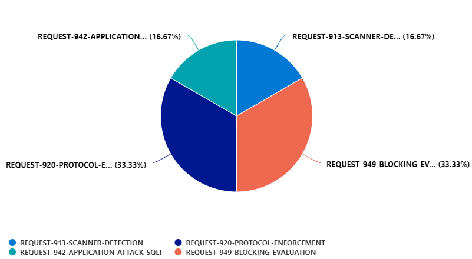

[](https://github.com/FrodeHus/modsecurity-loganalytics/actions/workflows/dotnet.yml)

[](https://github.com/FrodeHus/modsecurity-loganalytics/actions/workflows/main.yml)

# ModSecurity logger for Azure Log Analytics

Simple console application that monitors a folder and sends off ModSecurity logs to Azure Log Analytics (buffered - every 2 minutes by default).

```text
ModSecurityLogger 1.0.0
Copyright (C) 2021 ModSecurityLogger

  -w, --workspace      ID of your workspace

  -l, --log            Name of the datasource/log you wish to send data to

  -k, --key            Access key secret

  -f, --logfile        ModSecurity audit log file (ie. /var/log/modsec_audit.log)

  -c, --config-file    Provide all configuration via file

  --help               Display this help screen.

  --version            Display version information.

```

Configuration file follows this format (use this to lock down permissions and not have secrets show up in arguments):

```json
{
    "WorkspaceId": "123",
    "SharedAccessKey": "secret",
    "LogName": "ModSecurity",
    "AuditLogFile": "/var/log/modsecurity/audit.log"
}
```

Workspace ID and Access key can also be specified using environment variables WORKSPACE_ID and WORKSPACE_SHARED_KEY.

## Configure your ModSecurity

Make sure your `modsecurity.conf` has the following configuration:

```text
SecAuditLogType Concurrent
SecAuditLogStorageDir /var/log/modsecurity/audit
SecAuditLogFormat JSON
```


## Create a Log Analytics Workspace

You can use this quick deploy to create a Workspace for playing around

[](https://portal.azure.com/#create/Microsoft.Template/uri/https%3A%2F%2Fraw%2Egithubusercontent%2Ecom%2FFrodeHus%2Fmodsecurity%2Dloganalytics%2Fmain%2Ftemplates%2Fazure%2Ddeploy%2Ejson)

## LogAnalytics.Client

This repo also contains a Log Analytics API client which can be used standalone.

## Example config

In this repo, there is a sample configuration for nginx with a aspnet.core _Hello world!_ sample backend in [modsec-nginx](modsec-nginx).
It also makes sure that certain security headers are included in the response just in case the backend doesn't supply them itself.

Using the supplied `docker-compose.yml` you should be able to run a `modsecurity+nginx with ModSecurityLogger` proxy in front of the ASPNET.Core sample backend by simply issuing a `docker-compose up --build` command.

Add `www.sample.com` to your `/etc/hosts` and give it a spin!

Or just hit up the proxy with `curl "http://localhost/?1' or 1=1--"` and watch your new WAF block your request and log it to Log Analytics (provided you configured your own workspace and shared key).

## The most prevalent OWASP rule violations

Once the logs are in Log Analytics Workspace, further analysis can be done and alert rules set up in Azure Sentinel - but one fun visualization is to see which OWASP rules are violated most often.

Run this query:

```kql
OpenWAF_CL
| order by TimeGenerated desc
| project t=todynamic(transaction_messages_s)
| mv-apply t on
(    extend file=tostring(t.details.file)
    | project rule=extract(@"([A-Z0-9\-]+)\.conf", 1, file)
)
| summarize count() by rule
|render piechart 
```

to get this:


